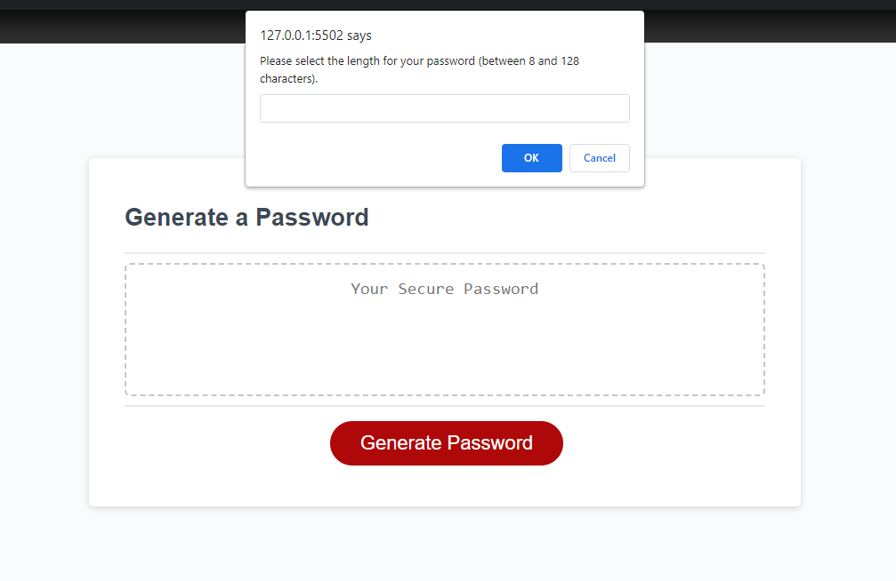
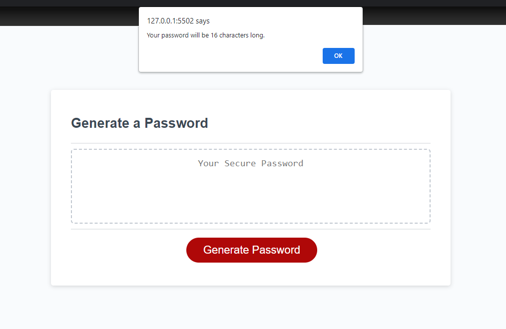
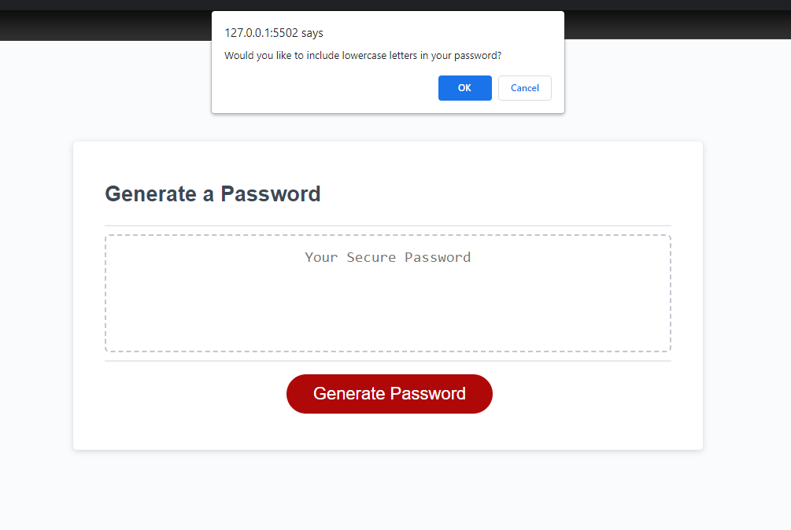
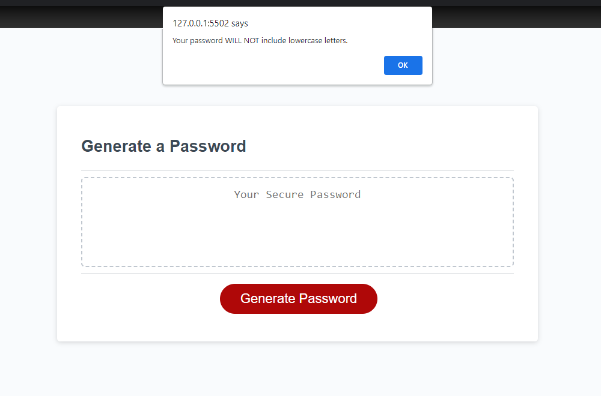
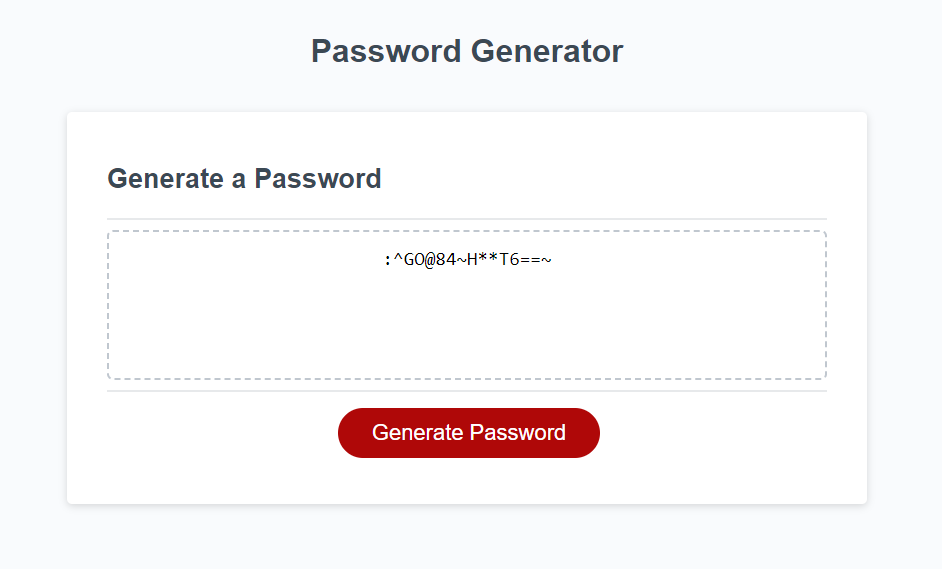

# javascript-password-generator

## Description

This assignment objective was to modify existing starter code to create an application that enables users to generate random passwords. The password criteria is based on user input (setting the desired password length and selecting whether or not to include uppercase letters, lowercase letters, numbers, and special characters/symbols). All interaction with the user will take place within the window alerts/ prompts.

Key reasons for making this password generator:
- To display a fundamental grasp of basic JavaScript interactions and behaviors
- To create variables and call them into functions within the script
- To show my ability to combine variables into larger arrays, include/exclude variables based on user input, and write function outputs to a webpage

## Features

- Both the HTML and CSS files were provided, and, thus, have not been modified. 
- Through this application, the user is able to determine a set length of characters (between 8 - 126) for their new random password.
- The window prompts and alerts walk the user through a series of questions to determine whether or not certain characters will be included within their new password.
- I've added confirmation text to inform the user of each decision. For example: after clicking "Cancel" in response to the question asking if they would like to include numbers, the window confirms this decision with "Your password WILL NOT include numbers." 

## Lessons Learned

- Through this exercise, I've gained a better understanding of how to define JavaScript variables, call them into functions, and return an output based on these functions.
- I initially had difficulty calling user input into a single array but was able to work through this issue to generate a "megaArray" and randomize the selection of items from within that array.
- This web application process also helped me understand how to nest functions within functions and move from one function to another without breaking the entire code. 😊

## Mock-Up

The following screenshots show several steps in the deployed web application from a desktop browser:

## Deployment

https://github.com/SunnyOhK/javascript-password-generator.git

## Acknowledgements

- [README Assistant](https://readme.so/)
- EdX tutor: Faran Navazi

## 🚀 About Me

I am a beginner coder in the Full Stack Coding Bootcamp through UT Austin and EdX. This is my first JavaScript application assignment.

## License

[MIT](https://choosealicense.com/licenses/mit/)